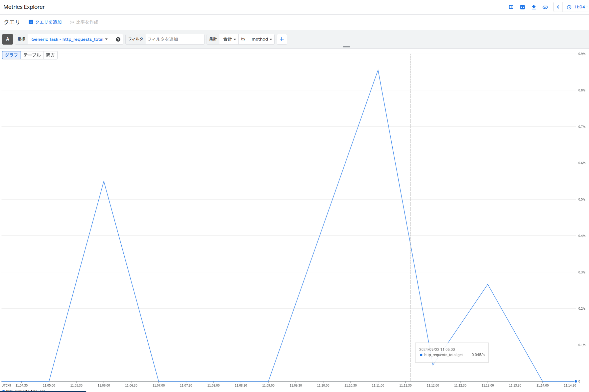
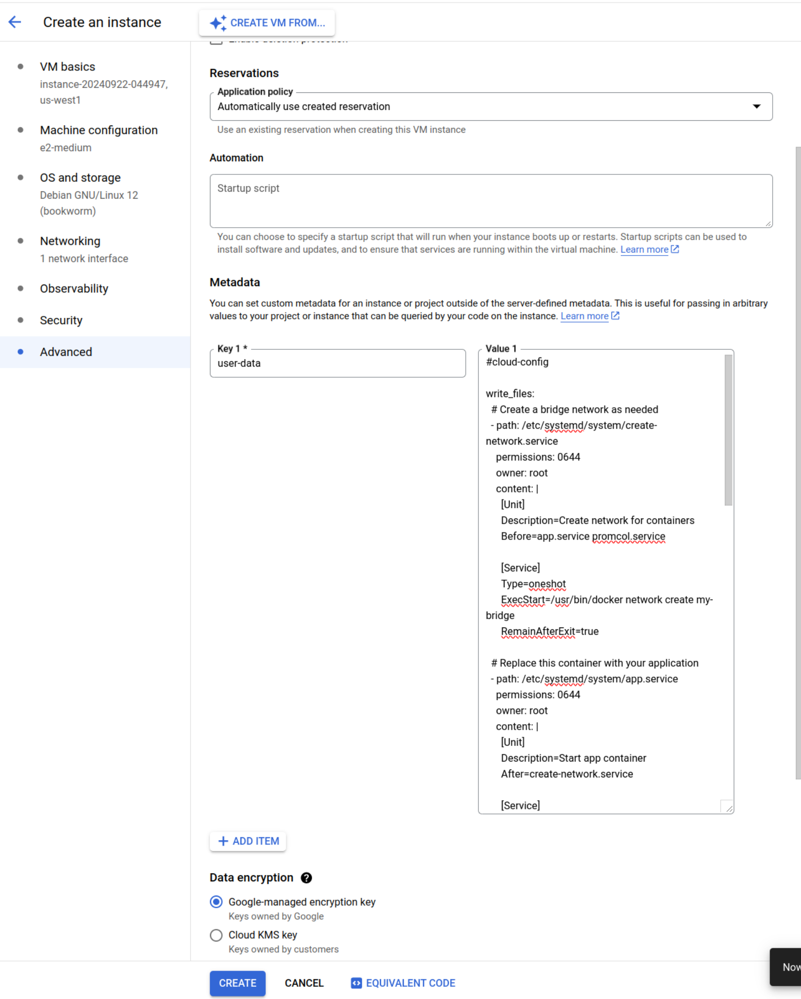

# otel-as-prom-agent

An OpenTelemetry custom collector to scrape Prometheus metrics and send them to Cloud Monitoring.

## Why

Currently, the Container-Optimized OS does not support Ops Agents. 

https://github.com/GoogleCloudPlatform/ops-agent/issues/325

This collector provides a way to monitor applications that output metrics in Prometheus format on COS.

> [!IMPORTANT]
> This is using the beta version of the receiver and exporter. Before using this collector, we recommend that you consider the possibility of adopting an OS other than COS.

## Getting Started
### Local (for testing)

Download the credentials of service account from Google Cloud and save it as `key.json` in this directory.
(Note that the `Monitoring Metric Writer` role is required)

Execute docker compose to start containers.

```sh
$ docker compose up
```

Now you can access to `localhost:8080` (top page) and `localhost:8080/metrics` (metrics endpoint).

And also, you can see the metrics in your Cloud Monitoring dashboard.



### Google Computing Engine

Launch your COS instance with cloud-init config as value of the key `user-data`.



Here is an example of cloud-config.

```yaml
#cloud-config

write_files:
  # Create a bridge network as needed
  - path: /etc/systemd/system/create-network.service
    permissions: 0644
    owner: root
    content: |
      [Unit]
      Description=Create network for containers
      Before=app.service promcol.service

      [Service]
      Type=oneshot
      ExecStart=/usr/bin/docker network create my-bridge
      RemainAfterExit=true

  # Replace this container with your application
  - path: /etc/systemd/system/app.service
    permissions: 0644
    owner: root
    content: |
      [Unit]
      Description=Start app container
      After=create-network.service

      [Service]
      Environment="HOME=/home/cloudservice"
      ExecStart=/usr/bin/docker run --rm --network my-bridge --name app quay.io/brancz/prometheus-example-app:v0.3.0
      ExecStop=/usr/bin/docker stop app

  - path: /etc/systemd/system/promcol.service
    permissions: 0644
    owner: root
    content: |
      [Unit]
      Description=Start promcol container
      After=create-network.service

      [Service]
      Environment="HOME=/home/cloudservice"
      ExecStart=/usr/bin/docker run --rm --network my-bridge -v /etc/config.yml:/etc/config.yml --name promcol ymtdzzz/otel-as-prom-agent:test ./prom-col --config=/etc/config.yml
      ExecStop=/usr/bin/docker stop promcol
      
  # Config used in this collector
  - path: /etc/config.yml
    permissions: 0644
    owner: root
    content: |
      receivers:
          prometheus:
            config:
              scrape_configs:
                - job_name: 'prom-col'
                  scrape_interval: 5s
                  static_configs:
                    - targets: ['app:8080']
      exporters:
        googlecloud:
          log:
            default_log_name: opentelemetry.io/collector-exported-log
      processors:
        batch:
      service:
        pipelines:
          metrics:
            receivers: [prometheus]
            processors: [batch] # NOTICE: use memory_limiter in production
            exporters: [googlecloud]

runcmd:
  - systemctl daemon-reload
  - systemctl start create-network.service
  - systemctl start app.service
  - systemctl start promcol.service
```

And now you can see the Prometheus metrics output from application in Metrics Explorer.
